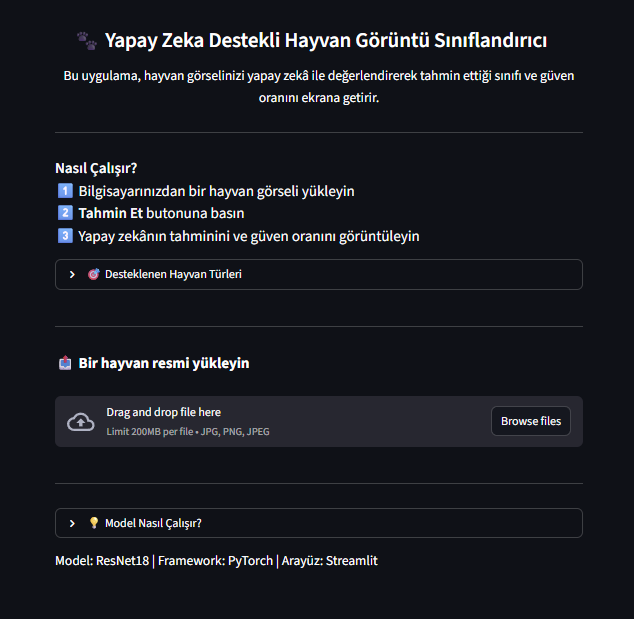
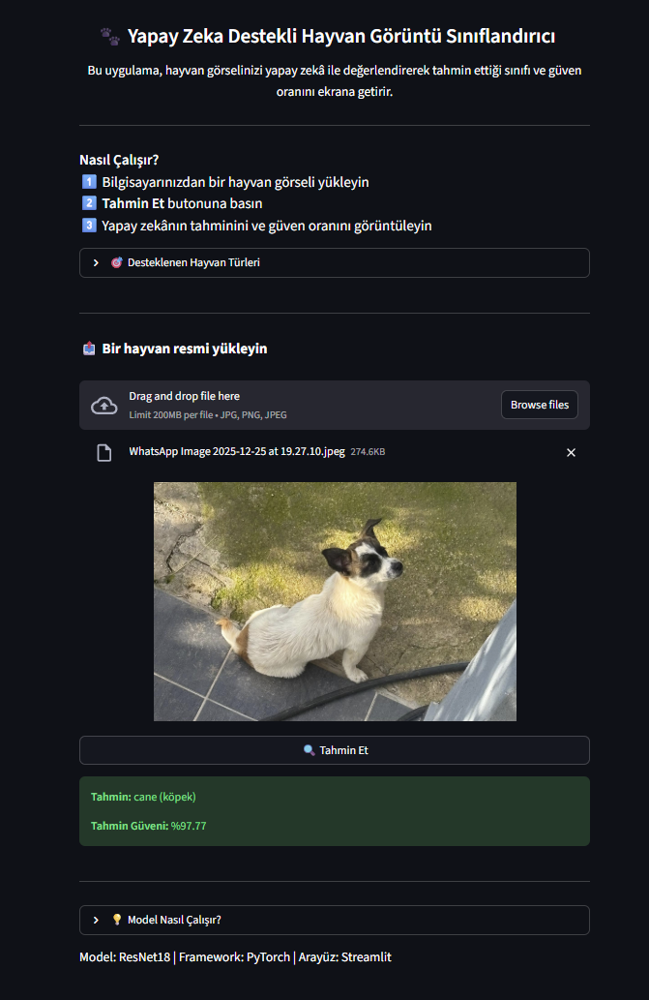
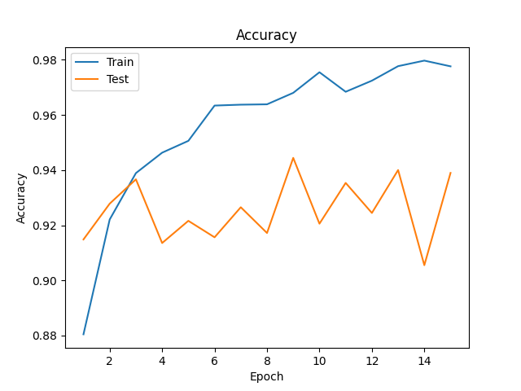
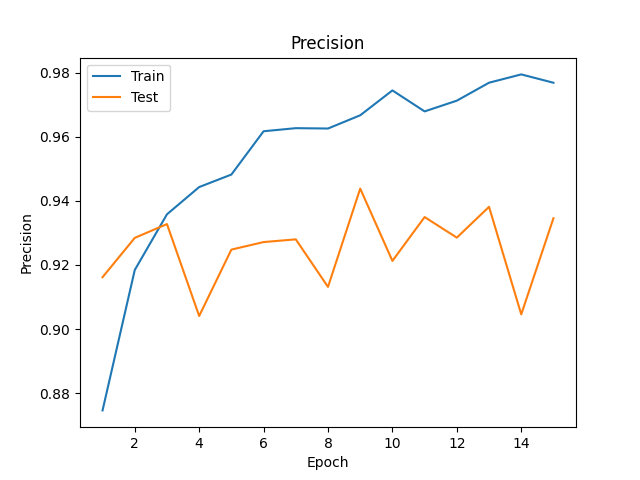
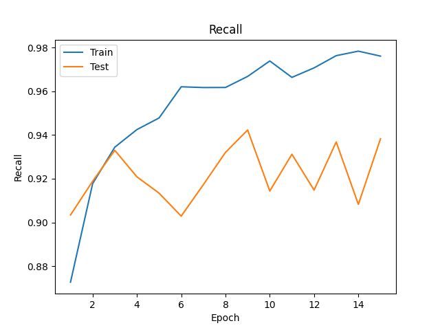
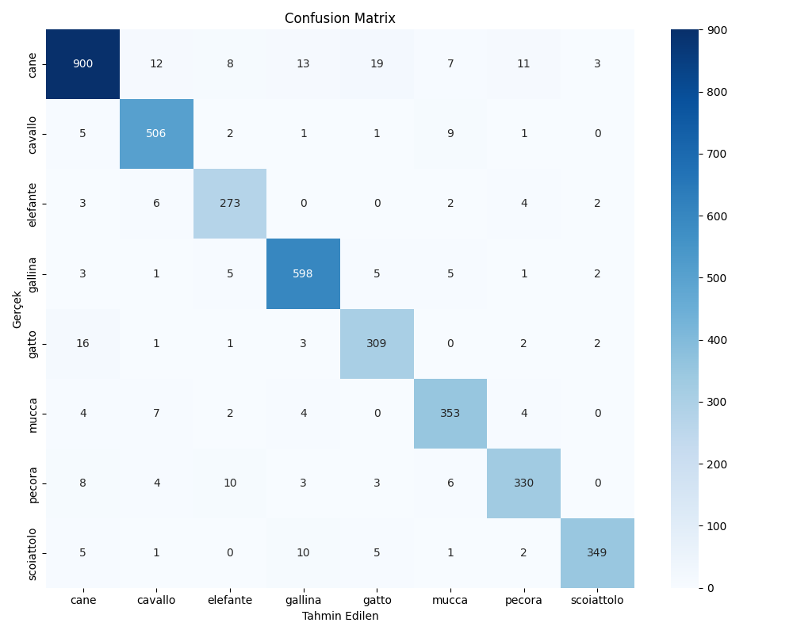
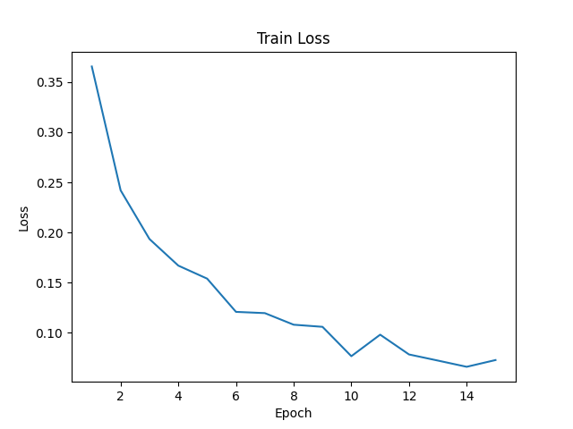

# 🐾 Yapay Zeka Destekli Hayvan Görüntü Sınıflandırıcı


Bu proje, bir görüntü sınıflandırma modeli geliştirerek kullanıcının yüklediği hayvan görsellerini tanıyabilen bir yapay zekâ uygulamasıdır. Model, PyTorch ile eğitilmiş ResNet18 kullanır ve Streamlit tabanlı kullanıcı dostu bir arayüz sunar.

---

## 📖 İçindekiler
- [Proje Tanımı](#proje-tanımı)
- [Özellikler](#özellikler)
- [Kurulum ve Çalıştırma](#kurulum-ve-çalıştırma)
- [Veri Seti Temini](#veri-seti-temini)
- [Veri Seti Hakkında Notlar](#veri-seti-hakkında-notlar)
- [Kullanım](#kullanım)
- [Demo Video](#demo-video)
- [Teknik Detaylar](#teknik-detaylar)
- [Eğitim ve Değerlendirme](#eğitim-ve-değerlendirme)
- [Desteklenen Hayvan Türleri](#desteklenen-hayvan-türleri)
- [Dosya Yapısı](#dosya-yapısı)
- [Kaynaklar](#kaynaklar)

---

## 📝 Proje Tanımı
Kullanıcılar bilgisayarlarından bir hayvan görseli yükleyebilir, model tarafından sınıflandırılan sonucu görebilir ve tahminin güven oranını öğrenebilir. Görseller normalize edilip modele uygun tensöre dönüştürülür ve en yüksek olasılıklı sınıf kullanıcıya gösterilir.

---

## ⚡ Özellikler
- Görüntü yükleme ve ön işleme (boyutlandırma, kırpma, normalization)
- PyTorch ResNet18 tabanlı sınıflandırma
- Streamlit tabanlı kullanıcı arayüzü
- Tahmin güven oranı gösterimi
- Kullanıcı dostu ve sade tasarım
- Eğitim metriklerinin görselleştirilmesi (Accuracy, Precision, Recall, Confusion Matrix)

---

## 🛠 Kurulum ve Çalıştırma

```bash
# 1️⃣ Gerekli kütüphaneleri yükleyin
pip install -r requirements.txt

# 2️⃣ Modeli Eğitme (Opsiyonel)
# Not: Projede eğitilmiş model mevcuttur. 
# Yeniden eğitmek isterseniz dataset klasörünü hazırlayıp şu komutu çalıştırın:
python train.py

# 3️⃣ Uygulamayı Başlatın
# Arayüzü açmak ve tahmin yapmak için:
streamlit run app.py
```

---

## 📂 Veri Seti Temini
> **💡 Bilgi:** Eğer sadece eğitilmiş modeli kullanacaksanız (arayüzü çalıştırmak için), veri setini indirmenize gerek yoktur.

**Veri seti sadece modeli yeniden eğitmek (`train.py`) isteyenler içindir:**
1. Proje dosyaları içerisinde veri seti (dataset) bulunmamaktadır. Veri setini [Animals-10 Dataset (Kaggle)](https://www.kaggle.com/datasets/alessiocorrado99/animals10) bağlantısından indirebilirsiniz.
2. İndirdiğiniz klasörü projenin ana dizinine `dataset/` adıyla yerleştirin.
3. Klasör yapısının şu şekilde olduğundan emin olun:
   - `dataset/train/`
   - `dataset/test/`

---

## ⚠️ Veri Seti Hakkında Notlar
Projenin eğitim aşamasında [Animals-10 Dataset](https://www.kaggle.com/datasets/alessiocorrado99/animals10) üzerinde şu güncellemeler yapılmıştır:
- **Sınıf Filtreleme:** Veri setinde bulunan `farfalla` (kelebek) ve `ragno` (örümcek) sınıfları analiz dışı bırakılarak veri setinden çıkartılmıştır.
- **Veri Ayrımı:** Mevcut veri setinin **%80'i eğitim (train)**, **%20'si ise test** süreçleri için kullanılmıştır.

---

## 🖥 Kullanım
- Web arayüzünde 📤 Bir hayvan resmi yükleyin kısmından bir görsel seçin.
- 🔍 Tahmin Et butonuna tıklayın.
- Model, tahmini sınıfı ve güven oranını gösterecektir.
- %85’in altında güven oranına sahip tahminler gösterilmez.


---

## 🎬 Demo Video
Uygulamanın kullanımını gösteren demo videosunu aşağıdaki linkten izleyebilirsiniz:  
[Demo Video](https://drive.google.com/drive/folders/1f215MEZkeOTz1jHJjy3R16L4wrD3HBDW?usp=sharing)

---

## 🧰 Teknik Detaylar
- **Model:** ResNet18  
- **Framework:** PyTorch  
- **Arayüz:** Streamlit  
- **Girdi Görüntü Boyutu:** 224x224  
- **Optimizasyon:** Adam, lr=3e-4  
- **Batch Size:** 32  
- **Epochs:** 15  
- **Ön İşleme:** Resize, CenterCrop, RandomHorizontalFlip, RandomRotation, Normalize  
- **Metrikler:** Accuracy, Precision, Recall, Confusion Matrix  
- **Cihaz:** CPU / GPU otomatik algılama  

---

## 📊 Eğitim ve Değerlendirme

Eğitim sırasında kayıp, doğruluk, precision ve recall değerleri loglanır (`trained_models/training_log.csv`) ve görselleştirilir (`metrics/` klasörü).  

### Accuracy


### Precision


### Recall


### Confusion Matrix


### Train Loss


---

## 🐾 Desteklenen Hayvan Türleri
- Köpek (cane)  
- At (cavallo)  
- Fil (elefante)  
- Tavuk (gallina)  
- Kedi (gatto)  
- İnek (mucca)  
- Koyun (pecora)   
- Sincap (scoiattolo)  

---

## 📁 Dosya Yapısı

```text
image_classifier/
├── dataset/
│   ├── test/
│   └── train/
├── metrics/
│   ├── accuracy.png
│   ├── confusion_matrix.png
│   ├── precision.png
│   ├── recall.png
│   └── train_loss.png
├── src/
│   ├── __pycache__/
│   ├── __init__.py
│   ├── data_utils.py
│   ├── model_utils.py
│   └── translate.py
├── trained_models/
│   ├── classes.json
│   ├── model.pth
│   └── training_log.csv
├── screenshot.png
├── app.py
├── README.md
├── requirements.txt
└── train.py
```


---

## 🔗 Kaynaklar
- [Animals-10 Dataset](https://www.kaggle.com/datasets/alessiocorrado99/animals10)  
- [PyTorch ResNet18 Örneği / Tutorials](https://pytorch.org/hub/pytorch_vision_resnet/)  
- [PyTorch Image Preprocessing & Transforms](https://pytorch.org/vision/stable/transforms.html)  
- [Streamlit Documentation](https://docs.streamlit.io/)

---
## 👤 Hazırlayan
- **Ad Soyad:** Gürel BİLGİN
- **Öğrenci Numarası:** 220502041
- **GitHub Repo:** [https://github.com/GurelBilgin/image-classifier](https://github.com/GurelBilgin/image-classifier)
